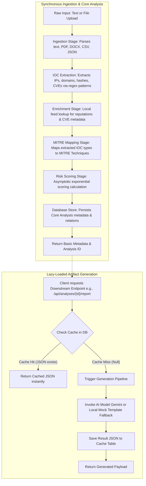
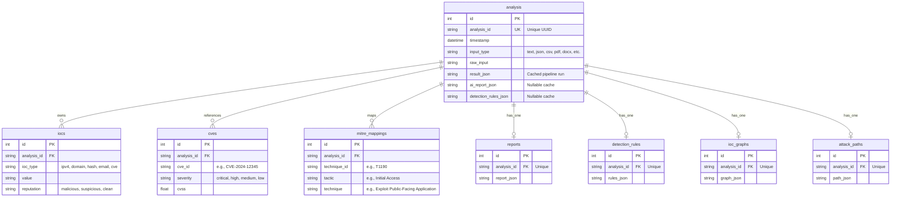

## frontend repo link :-https://github.com/Rrp14/Threat_analyzer_frontend
## backend api documentation :-https://threat-analyzer-nbhg.onrender.com/docs

# Threat Intelligence Platform (SOC Analyst Workbench)

An enterprise-grade, AI-powered Threat Intelligence Platform designed as a **SOC Analyst Workbench**. The platform ingest logs, threat reports, and network telemetry in various formats, extracts Indicators of Compromise (IOCs), enriches them with threat intelligence metadata (reputation, CVE parameters, MITRE techniques), calculates an asymptotic risk score, and lazy-loads advanced analytic reports, detection rules, relationship graphs, and attack paths.

---

## 📖 Table of Contents
- [System Architecture](#-system-architecture)
  - [Processing Workflow](#processing-workflow)
  - [Design Decisions & Patterns](#design-decisions--patterns)
- [🗄️ Database Schema & Relationships](#️-database-schema--relationships)
- [🚀 API Documentation](#-api-documentation)
  - [System Status Endpoints](#1-system-status-endpoints)
  - [Core Ingestion & Analysis Endpoints](#2-core-ingestion--analysis-endpoints)
  - [Lazy-Loaded Generation Endpoints](#3-lazy-loaded-generation-endpoints)
  - [Threat Hunting Search Endpoints](#4-threat-hunting-search-endpoints)
- [🔧 Installation & Setup Guide](#-installation--setup-guide)
  - [Backend Setup](#backend-setup)
  - [Frontend Architecture & Setup](#frontend-architecture--setup)
- [⚙️ Configuration Parameters (.env)](#️-configuration-parameters-env)

---

## 🏗️ System Architecture

The application is structured into decoupled layers where data ingestion, enrichment, and risk scoring are processed synchronously upon ingestion, while high-compute generation tasks (AI reports, Sigma/YARA rules, visual graphs, and attack timelines) are generated on-demand (lazy-loaded) and cached.

### Processing Workflow



### Design Decisions & Patterns

1. **Decoupled Stage Pipeline Pattern**:
   The ingestion backend leverages a pipeline orchestrator pattern (`ThreatAnalysisOrchestrator`) that manages sequential `PipelineStage` execution. This allows clean extensibility—adding new analysis layers simply requires registering a new stage class.
2. **Lazy-Loading & Caching Strategy**:
   Downstream endpoints like YARA/Sigma rule generation or executive AI reports are computationally and financially expensive. The backend implements lazy-loading: these fields are initialized as `NULL` in the database. When the analyst navigates to these tabs on the frontend, a request is made. If cached data is present, it resolves instantly; otherwise, it dynamically compiles it and updates the cache.
3. **Asymptotic Risk Scoring Engine**:
   Rather than simple linear addition, the risk score runs on an exponential asymptotic formula to ensure score scaling stays within the bounds of `0` to `100`:
   $$\text{Total Score} = \text{round}\left(100 \times \left(1 - e^{-\frac{\text{Sum of Factor Scores}}{100}}\right)\right)$$
   This represents cumulative threat weight while preventing score overflow. The risk scores are categorized as:
   - **Low**: $\le 30$
   - **Medium**: $\le 60$
   - **High**: $\le 80$
   - **Critical**: $> 80$
4. **LLM Integration & Fallback**:
   The primary AI driver is the **Gemini 2.5 Flash** model. If `GEMINI_API_KEY` is not supplied, the platform seamlessly drops back to structural mock templates to keep the workspace fully functional during offline development.

---

## 🗄️ Database Schema & Relationships

The database is built on SQLAlchemy and supports SQLite (local development) and PostgreSQL (production). 



---

## 🚀 API Documentation

### 1. System Status Endpoints

#### Health Check
* **Endpoint**: `GET /system/health`
* **Description**: Verifies API backend and database connection status.
* **Response (200 OK)**:
```json
{
  "status": "healthy",
  "version": "0.1.0"
}
```

---

### 2. Core Ingestion & Analysis Endpoints

#### Ingest Text/Logs
* **Endpoint**: `POST /api/analyze`
* **Description**: Extracts IOCs/CVEs and returns synchronous analysis metadata.
* **Request Body**:
```json
{
  "input_type": "text",
  "content": "Pasted raw logs containing indicators like 198.51.100.42 and CVE-2024-12345."
}
```
* **Response (200 OK)**:
```json
{
  "analysis_id": "84a7e9b0-bc32-4d1a-be1e-7f6c382d54e1",
  "ioc_count": 2,
  "risk_score": {
    "score": 85,
    "level": "critical",
    "factors": [
      {
        "factor": "ioc_reputation",
        "score": 95,
        "description": "198.51.100.42 reputation is malicious"
      }
    ]
  },
  "mitre_mappings": [
    {
      "id": "T1190",
      "tactic": "Initial Access",
      "technique": "Exploit Public-Facing Application"
    }
  ]
}
```

#### Ingest File Upload
* **Endpoint**: `POST /api/analyze/upload`
* **Description**: Processes files directly (`.txt`, `.json`, `.csv`, `.pdf`, `.docx`).
* **Request Body**: Multipart form data with key `file`.
* **Response (200 OK)**:
```json
{
  "analysis_id": "84a7e9b0-bc32-4d1a-be1e-7f6c382d54e1",
  "ioc_count": 5,
  "risk_score": {
    "score": 88,
    "level": "critical"
  }
}
```

#### List All Analyses
* **Endpoint**: `GET /api/analyses`
* **Description**: Retrieves a list of past ingested records.
* **Response (200 OK)**:
```json
[
  {
    "analysis_id": "84a7e9b0-bc32-4d1a-be1e-7f6c382d54e1",
    "timestamp": "2026-06-25T04:14:25+00:00",
    "input_type": "text"
  }
]
```

#### Get Analysis Details
* **Endpoint**: `GET /api/analyses/{analysis_id}`
* **Description**: Retrieves the complete data context generated during synchronous stages.
* **Response (200 OK)**:
```json
{
  "analysis_id": "84a7e9b0-bc32-4d1a-be1e-7f6c382d54e1",
  "timestamp": "2026-06-25T04:14:25Z",
  "input_type": "text",
  "raw_input": "...",
  "iocs": [
    {
      "type": "ipv4",
      "value": "198.51.100.42",
      "reputation": "malicious",
      "enriched": true
    }
  ],
  "enrichment": {
    "cves": [
      {
        "id": "CVE-2024-12345",
        "cvss": 9.8,
        "severity": "critical",
        "exploit_available": true,
        "affected_products": ["Apache Tomcat 10.x"]
      }
    ],
    "malware_families": ["CobaltStrike"],
    "threat_actors": ["APT41"]
  },
  "mitre_mapping": [
    {
      "id": "T1190",
      "tactic": "Initial Access",
      "technique": "Exploit Public-Facing Application"
    }
  ],
  "risk_score": {
    "score": 85,
    "level": "critical",
    "factors": [...]
  }
}
```

---

### 3. Lazy-Loaded Generation Endpoints

#### Generate AI Threat Report
* **Endpoint**: `POST /api/analyses/{analysis_id}/report`
* **Description**: Uses Gemini to build executive threat assessments.
* **Response (200 OK)**:
```json
{
  "summary": "Executive summary detailing critical infrastructure compromise...",
  "analysis_overview": "Deep dive into the indicators...",
  "attack_scenario": "Threat actor APT41 likely used CVE-2024-12345...",
  "business_impact": "High risk of IP leakage...",
  "immediate_actions": [
    {
      "title": "Block Malicious IP",
      "description": "Drop traffic to/from 198.51.100.42",
      "priority": "critical"
    }
  ],
  "long_term_remediation": [...],
  "monitoring": [...]
}
```

#### Generate Detection Rules
* **Endpoint**: `POST /api/analyses/{analysis_id}/detection`
* **Description**: Compiles Sigma, YARA, and Splunk queries.
* **Response (200 OK)**:
```json
{
  "sigma": {
    "title": "APT41 Infiltration Attempt",
    "yaml": "title: APT41 Infiltration Attempt\nid: a27c73a0-f8f4-41da-ba0b-d24be514757c\n..."
  },
  "yara": {
    "rule_name": "APT41_Tomcat_Exploit",
    "source": "rule APT41_Tomcat_Exploit {\n  strings:\n    $tomcat_cmd = \"/bin/bash -c\"\n  condition:\n    $tomcat_cmd\n}"
  },
  "siem_queries": [
    {
      "platform": "splunk",
      "query": "index=web_logs src_ip=\"198.51.100.42\""
    }
  ]
}
```

#### Generate IOC Relationship Graph
* **Endpoint**: `POST /api/analyses/{analysis_id}/graph`
* **Description**: Outputs nodes/edges mapping threat links.
* **Response (200 OK)**:
```json
{
  "nodes": [
    { "id": "198.51.100.42", "label": "198.51.100.42", "type": "ipv4" },
    { "id": "CVE-2024-12345", "label": "CVE-2024-12345", "type": "cve" },
    { "id": "T1190", "label": "Exploit Public-Facing Application", "type": "mitre" }
  ],
  "edges": [
    { "source": "198.51.100.42", "target": "T1190", "relationship": "related_to" },
    { "source": "CVE-2024-12345", "target": "T1190", "relationship": "mapped_to" }
  ]
}
```

#### Generate Attack Path Predictions
* **Endpoint**: `POST /api/analyses/{analysis_id}/attack-path`
* **Description**: Predicts sequential steps threat actor will take.
* **Response (200 OK)**:
```json
{
  "confidence": 0.85,
  "stages": [
    {
      "stage": "Initial Access",
      "technique_id": "T1190",
      "description": "Exploiting vulnerable Tomcat webservers.",
      "confidence": 0.95
    },
    {
      "stage": "Execution",
      "technique_id": "T1059",
      "description": "Command execution via web shell to drop payloads.",
      "confidence": 0.88
    }
  ]
}
```

---

### 4. Threat Hunting Search Endpoints

These endpoints support wildcard searches across historical logs stored in specific columns of backend tables.

* **Search IOC**: `GET /api/search/ioc?value={value}` (searches IPs, domains, hashes)
* **Search CVE**: `GET /api/search/cve?cve_id={cve_id}` (searches database mappings for CVEs)
* **Search MITRE Technique**: `GET /api/search/mitre?technique_id={technique_id}` (searches database records matching technique IDs)

---

## 🔧 Installation & Setup Guide

### Backend Setup

#### Prerequisites
- Python 3.10+
- SQLite (or access to a PostgreSQL instance)

#### 1. Clone & Set Up Environment
```bash
# Set up a python virtual environment
python -m venv venv
venv\Scripts\activate      # On Windows
source venv/bin/activate  # On Linux/macOS

# Install package dependencies
pip install -r requirements.txt
```

*Note: Core Python packages include `fastapi`, `uvicorn`, `sqlalchemy`, `pydantic-settings`, `google-genai`, `pypdf`, and `python-docx`.*

#### 2. Run Backend Dev Server
```bash
# Start backend server
uvicorn app.main:app --host 127.0.0.1 --port 8000 --reload
```
Once started, the OpenAPI interactive docs will be available at `http://127.0.0.1:8000/docs`.

---

### Frontend Architecture & Setup

The user interface represents a **SOC Analyst Workbench** matching the visual aesthetic and functional depth of enterprise tools like CrowdStrike Falcon, SentinelOne, and Recorded Future.

#### Frontend Technology Stack
- **Framework**: Next.js 15 (App Router) with TypeScript and TailwindCSS.
- **UI Library & Iconography**: shadcn/ui and Lucide React.
- **Visualizations & Charts**: React Flow (IOC node graphs) and Recharts (risk dashboards).
- **Code Display & Editors**: `@monaco-editor/react` (configured in read-only dark mode).
- **Data Hydration**: TanStack Query (React Query) v5 and Axios.

#### Design System & Aesthetics
- **Theme**: Deep obsidian dark mode background (`#0B0F17`) with glassmorphic cards (`#131A26/80` with `backdrop-blur-md` and `border-slate-800/60`).
- **Accent colors**: Neon Cyan (`#00E5FF`) for interactions, Threat Purple (`#7C3AED`) for secondary alerts.
- **Threat severity signals**: 
  - **CRITICAL**: Electric Red (`#EF4444`) with a glowing pulse.
  - **HIGH**: Orange (`#F97316`)
  - **MEDIUM**: Cyber Yellow (`#EAB308`)
  - **LOW**: Mint Green (`#10B981`)

#### Ingest State Integration Pattern (React Query)
To integrate with the backend lazy-loading endpoints cleanly:
```typescript
import { useQuery, useMutation, useQueryClient } from '@tanstack/react-query';
import axios from 'axios';

const API_BASE = 'http://localhost:8000/api';

export function useLazyReport(analysisId: string) {
  const queryClient = useQueryClient();

  const reportQuery = useQuery({
    queryKey: ['analyses', analysisId, 'report'],
    queryFn: async () => {
      const response = await axios.get(`${API_BASE}/analyses/${analysisId}`);
      return response.data.ai_report || null;
    },
    retry: false
  });

  const generateMutation = useMutation({
    mutationFn: async () => {
      const response = await axios.post(`${API_BASE}/analyses/${analysisId}/report`);
      return response.data;
    },
    onSuccess: (data) => {
      queryClient.setQueryData(['analyses', analysisId, 'report'], data);
    }
  });

  return {
    report: reportQuery.data,
    isLoading: reportQuery.isLoading,
    isGenerating: generateMutation.isPending,
    generateReport: generateMutation.mutate,
    error: reportQuery.error || generateMutation.error
  };
}
```

---

## ⚙️ Configuration Parameters (.env)

Modify or create a `.env` file in the root directory to customize the backend instance:

| Variable Name | Type | Default Value | Description |
|---|---|---|---|
| `APP_NAME` | String | `Threat Intelligence Platform` | Label displayed in OpenAPI documentation header. |
| `APP_VERSION` | String | `0.1.0` | Application version tracking parameter. |
| `DATABASE_URL` | String | `sqlite:///./threat.db` | Connection string. For production, supply postgresql link. |
| `LOG_LEVEL` | String | `INFO` | Level of logging output (`DEBUG`, `INFO`, `WARNING`, `ERROR`). |
| `AI_PROVIDER` | String | `gemini` | AI vendor parameter. |
| `GEMINI_API_KEY` | String | *None* | Google GenAI API key. If empty, local templates are loaded. |
| `GEMINI_MODEL` | String | `gemini-2.5-flash` | Model identifier used during LLM completion. |
